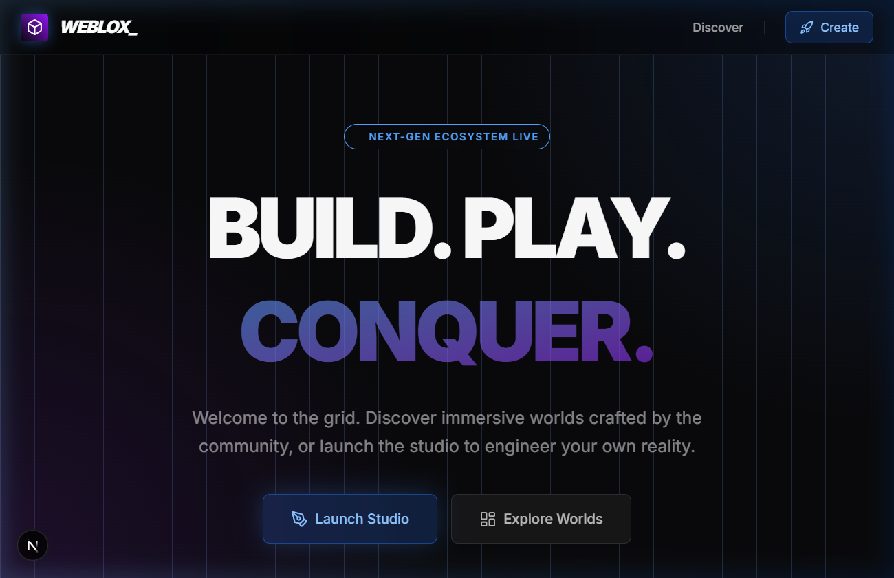

<h1 align="center">WeBlox 🌐</h1>

<p align="center">
  
  
  
  
  
</p>

<p align="center">
  <b>A Next-Generation 3D Sandbox & Multiplayer Engine inspired by Roblox.</b><br/>
  Build, Play, and Conquer in immersive worlds crafted entirely in your browser.
</p>

<br/>

<div align="center">
  
</div>

<br/>

---

## ✨ Features

- **Roblox-Style HUD & Chat:** A fully immersive in-game HUD featuring translucent overlays, clean typography, and a functional leaderboard.
- **Flawless Multiplayer Sync:** Powered by a custom 20Hz WebSockets `TickEngine` for smooth avatar movements and real-time state synchronization.
- **Advanced Physics & Mechanics:** Utilize the Rapier physics engine for complex mechanics like Moving Platforms, Conveyor Belts, Trampolines, Trigger Zones, and Checkpoints.
- **In-Browser Studio Editor:** A robust, 4-panel world builder with drag-and-drop primitives, a property inspector, transform gizmos, and undo/redo history.
- **Cinematic Rendering:** Next-level graphics powered by React Three Fiber Post-Processing, featuring Bloom, Vignettes, custom animated Water/Lava shaders, and atmospheric Fog.
- **Ultra-Premium UI:** An entirely glassmorphic frontend built with Tailwind CSS v4, Framer Motion, and Lucide Icons.

<br/>

---

## 🚀 Getting Started

### Prerequisites
- Node.js (v18+)
- SQLite (included via Prisma)

### Installation

1. **Clone the repository:**
   ```bash
   git clone https://github.com/IRSPlays/WebBlox.git
   cd WebBlox
   ```

2. **Install dependencies:**
   ```bash
   npm install
   ```

3. **Initialize the Database:**
   ```bash
   npx prisma db push
   ```

4. **Run the Development Server:**
   ```bash
   npm run dev
   ```

---

## 🛠️ Architecture Overview

- **Frontend:** Next.js 15 App Router, React 19, Tailwind CSS v4, Framer Motion
- **3D Engine:** Three.js, React Three Fiber, React Three Drei, Postprocessing
- **Physics:** `@react-three/rapier`
- **Backend/Multiplayer:** Custom Node.js Server (`server.ts`) with `socket.io` running alongside the Next.js API.
- **Database:** Prisma ORM with SQLite (scalable to PostgreSQL).

<br/>

<div align="center">
  <p>Built with ❤️ by the community.</p>
</div>
